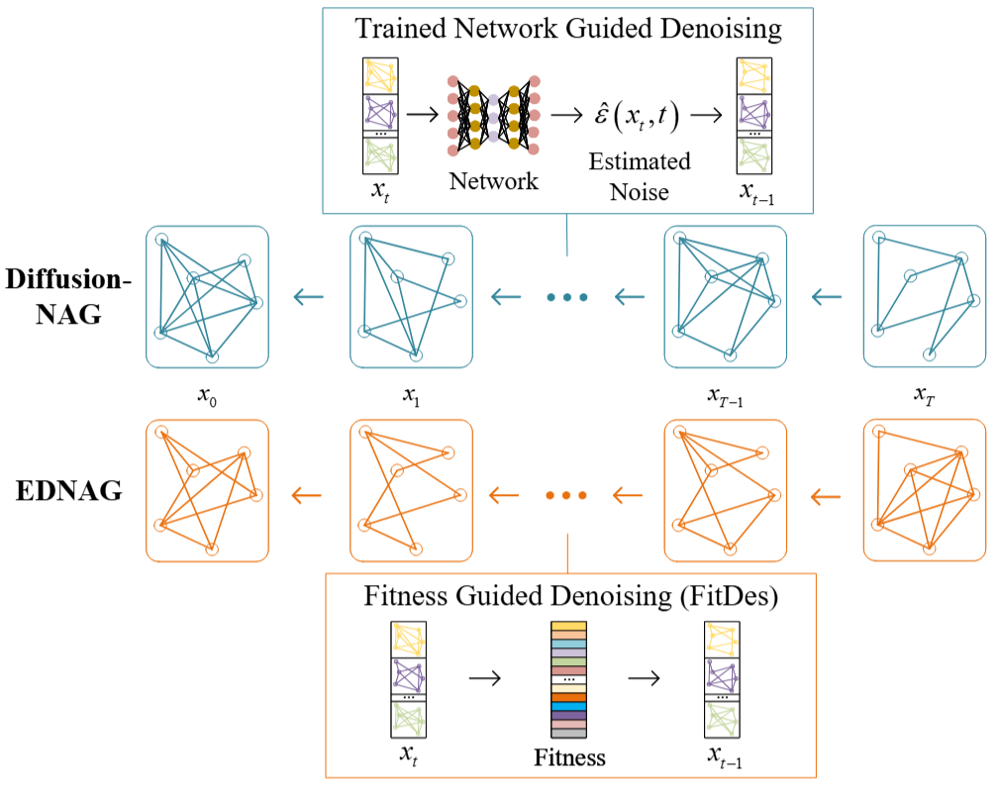
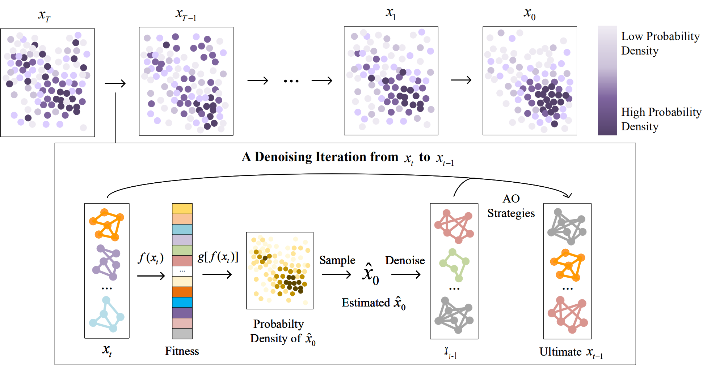
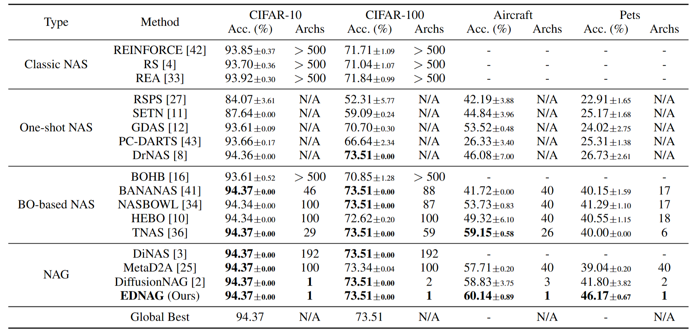
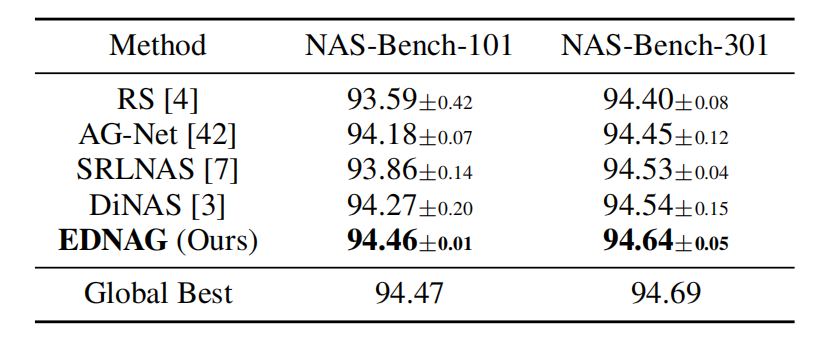
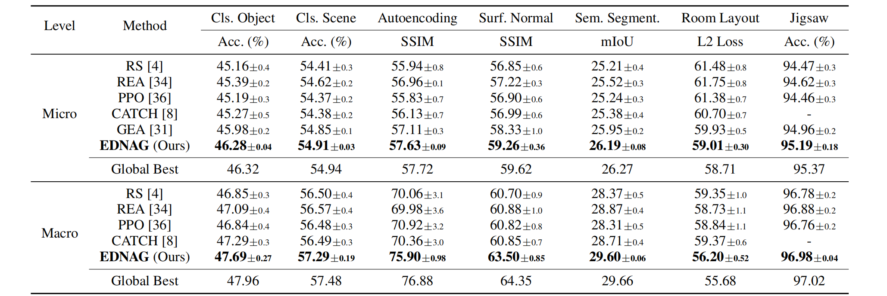
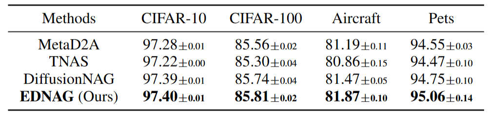

# EDNAG
This repository contains the code for the paper "Evolution Meets Diffusion: Efficient Neural Architecture Generation" (EDNAG: **E**volutionary **D**iffusion-based **N**eural **A**rchitecture **G**eneration).         

## Overview


Neural Architecture Search (NAS) has gained widespread attention for its transformative potential in deep learning model design. However, the vast and complex search space of NAS leads to significant computational and time costs. Neural Architecture Generation (NAG) addresses this by reframing NAS as a generation problem, enabling the precise generation of optimal architectures for specific tasks. Despite its promise, mainstream methods like diffusion models face limitations in global search capabilities and are still hindered by high computational and time demands. To overcome these challenges, we propose Evolutionary Diffusion-based Neural Architecture Generation (EDNAG), a novel approach that achieves efficient and training-free architecture generation. EDNAG leverages evolutionary algorithms to simulate the denoising process in diffusion models, using fitness to guide the transition from random Gaussian distributions to optimal architecture distributions. This approach combines the strengths of evolutionary strategies and diffusion models, enabling rapid and effective architecture generation. Extensive experiments demonstrate that EDNAG achieves state-of-the-art (SOTA) performance in architecture optimization, with an improvement in accuracy of up to 10.45%. Furthermore, it eliminates the need for time-consuming training and boosts inference speed by an average of 50×, showcasing its exceptional efficiency and effectiveness.



- You can find the paper [here](https://arxiv.org/abs/2504.17827).

## Code Snippets
Using the code for NAS-Bench-201 search space as an example:
- `main.py`: The entry point of the program, which parses arguments and calls `experiments.py`.
- `experiments.py`: The pipeline for experiments, setting random seeds and providing the workflow for `generation`-`get_topk_archs`-`evaluate_archs`.
- `evo_diff.py`: Neural architecture generation, implementing the pipeline of the Fitness-guided Denoising (FD) Strategy.
- `ddim.py` and `predictor.py`: DDIM denoising process in the FD strategy.
- `corrector.py`: Selection-based optimization strategy in EDNAG.
- `mapping.py`: Definition and implementation of Fitness-to-Probability Mapping functions.
- `analyse.py`: Conversion between two neural architecture representations, matrix and string.
- `meta_fitness.py`: Fitness evaluation by a dataset-aware meta neural predictor.
- `coreset.py`: Core dataset image selection for the neural predictor.
- `nb201_fitness.py`: Get architecture accuracy by querying the NAS-Bench-201 benchmark table.
- `eval_arch.py`: Evaluate architectures by training and testing.
- `config.py`: Configurations for experiment parameters and random seeds.
  
#### Detailed Explaination
Step-by-step denoising iterations in the code.
```python
scheduler = DDIMSchedulerCosine(num_step=100)
for t, alpha in scheduler:
    fitness = two_peak_density(x, std=0.25)
    print(f"fitness {fitness.mean().item()}")
    # apply the power mapping function
    generator = BayesianGenerator(x, mapping_fn(fitness), alpha)
    x = generator(noise=0.1)
    trace.append(x)
```

Get the predicted $\hat{x_0}$ using the estimator function.
```python
def generate(self, noise=1.0, return_x0=False):
    x0_est = self.estimator(self.x)
    x_next = ddim_step(self.x, x0_est, (self.alpha, self.alpha_past), noise=noise)
    if return_x0:
        return x_next, x0_est
    else:
        return x_next
```

Perform iterative denoising using the formula $x_{t-1} = \sqrt{\alpha_{t-1}} \cdot \hat{x_0} + \sqrt{1 - \alpha_{t-1} - \sigma^2_t} \cdot \hat{\epsilon} + \sigma_t w$.
```python
def ddim_step(xt, x0, alphas: tuple, noise: float = None):
    alphat, alphatp = alphas
    sigma = ddpm_sigma(alphat, alphatp) * noise
    eps = (xt - (alphat ** 0.5) * x0) / (1.0 - alphat) ** 0.5
    if sigma is None:
        sigma = ddpm_sigma(alphat, alphatp)
    x_next = (alphatp ** 0.5) * x0 + ((1 - alphatp - sigma ** 2) ** 0.5) * eps + sigma * torch.randn_like(x0)
    return x_next
```

$\sigma$ is calculated by the variance of $x_t$, $\sigma = \sqrt{\frac{(1 - \alpha_{t'})}{(1 - \alpha_t)} \cdot \left(1 - \frac{\alpha_t}{\alpha_t}\right)}$, which the author notes is the default formula used in DDPM.
```python
def ddpm_sigma(alphat, alphatp):
    return ((1 - alphatp) / (1 - alphat) * (1 - alphat / alphatp)) ** 0.5
```

Balance of Convergence and Diversity：

`elite_rate` ensures the best samples are retained during iterations, ensuring convergence. `diver_rate` ensures diverse samples are retained during iterations, ensuring diversity.
`mutate_rate` controls the number of samples that undergo mutation, and `mutate_distri_index` controls the scale of mutation to ensure exploration of the solution space.

## Experiments


### NAS-Bench-201

Before experiments, download following 11 dataset files.  

<h4 style="color:gray">1. AIRCRAFT</h4>

#### Save Path
./meta_acc_predictor/data/fgvc-aircraft-2013b
#### Download URL
- https://www.robots.ox.ac.uk/~vgg/data/fgvc-aircraft/archives/fgvc-aircraft-2013b.tar.gz

<h4 style="color:gray">2. PETS</h4>  

#### Save Path
./meta_acc_predictor/data/pets/
#### Download URL
- https://www.dropbox.com/s/kzmrwyyk5iaugv0/test15.pth?dl=1
- https://www.dropbox.com/s/w7mikpztkamnw9s/train85.pth?dl=1

<h4 style="color:gray">3. NASBENCH201</h4>

#### Save Path
./meta_acc_predictor/data/nasbench201.pt
#### Download URL
- https://github.com/CownowAn/DiffusionNAG/blob/main/NAS-Bench-201/data/transfer_nag/nasbench201.pt

<h4 style="color:gray">4. META_PREDICTOR</h4>  

#### Save Path
./meta_acc_predictor/unnoised_checkpoint.pth.tar
#### Download URL
- https://drive.google.com/file/d/1S2IV6L9t6Hlhh6vGsQkyqMJGt5NnJ8pj/view?usp=sharing

<h4 style="color:gray">5. CIFAR10_BY_LABEL</h4>  

#### Save Path
./meta_acc_predictor/data/meta_predictor_dataset/cifar10bylabel.pt
#### Download URL
- https://www.dropbox.com/s/wt1pcwi991xyhwr/cifar10bylabel.pt?dl=1

<h4 style="color:gray">6. CIFAR100_BY_LABEL</h4>  

#### Save Path
./meta_acc_predictor/data/meta_predictor_dataset/cifar100bylabel.pt
#### Download URL
- https://www.dropbox.com/s/nn6mlrk1jijg108/aircraft100bylabel.pt?dl=1

<h4 style="color:gray">7. AIRCRAFT_BY_LABEL</h4>  

#### Save Path
./meta_acc_predictor/data/meta_predictor_dataset/aircraftbylabel.pt
#### Download URL
- https://www.dropbox.com/s/nn6mlrk1jijg108/aircraft100bylabel.pt?dl=1

<h4 style="color:gray">8. PETS_BY_LABEL</h4>  

#### Save Path
./meta_acc_predictor/data/meta_predictor_dataset/petsbylabel.pt
#### Download URL
- https://www.dropbox.com/s/mxh6qz3grhy7wcn/petsbylabel.pt?dl=1

<h4 style="color:gray">9. IMAGENET32_BY_LABEL</h4>  

#### Save Path
./meta_acc_predictor/data/meta_predictor_dataset/imgnet32bylabel.pt
#### Download URL
- https://www.dropbox.com/s/7r3hpugql8qgi9d/imgnet32bylabel.pt?dl=1

<h4 style="color:gray">10. NAS_BENCH_201_API_V1.0</h4>  

#### Save Path
./nas_201_api/NAS-Bench-201-v1_0-e61699.pth
#### Download URL
- https://drive.google.com/open?id=1SKW0Cu0u8-gb18zDpaAGi0f74UdXeGKs

<h4 style="color:gray">11. NAS_BENCH_201_API_V1.3</h4>  

#### Save Path
./nas_201_api/NAS-Bench-201-v1_1-096897.pth
#### Download URL
- https://drive.google.com/open?id=16Y0UwGisiouVRxW-W5hEtbxmcHw_0hF_

<h4 style="color:gray">Install</h4>

```
cd NAS-Bench-201
conda create -n evo_diff python=3.12.2
pip install -r requirements.txt
```

Note: If you use PyTorch >= 2.6, you should add `weights_only=False` for every `torch.load()`, because the default value of the `weights_only` argument in `torch.load` is changed from `False` to `True` in PyTorch 2.6. 

<h4 style="color:gray">Reproduce the results</h4>

```
python ./main.py --dataset cifar10
python ./main.py --dataset cifar100
python ./main.py --dataset imagenet
python ./main.py --dataset aircraft
python ./main.py --dataset pets
```

<h4 style="color:gray">Run random experiments</h4>

```
python ./main.py --exp_type random --dataset cifar10
python ./main.py --exp_type random --dataset cifar100
python ./main.py --exp_type random --dataset imagenet
python ./main.py --exp_type random --dataset aircraft
python ./main.py --exp_type random --dataset pets
```


<h4 style="color:gray">Architecture Examples</h4>

Nodes represent operations, while adjacency matrices are fixed. Therefore, it is only necessary to generate a matrix of node operations. The size of the operation matrix is (number of node layers, number of candidate operands). 
Since `ops = ['input', 'output', 'none', 'skip_connect', 'nor_conv_1x1', 'nor_conv_3x3', 'avg_pool_3x3']`, there are 8 layers of nodes and 7 layers of operation. 

<h4 style="color:gray">Experiments Results</h4>



### NAS-Bench-101
Download the NAS-Bench-101 dataset from [nasbench_full.tfrecord](https://storage.googleapis.com/nasbench/nasbench_full.tfrecord) or [nasbench_only108.tfrecord](https://storage.googleapis.com/nasbench/nasbench_only108.tfrecord) (recommended).

Put the downloaded file in the `NAS-Bench-101/nasbench/` folder. 

Then you should prepare the environment for NAS-Bench-101, you can go to folder `NAS-Bench-101/nasbench`.
Run the following command to install the requirements:
```bash
pip install -e .
```
If you meet some troubles, you can refer to the [NAS-Bench-101-github](https://github.com/google-research/nasbench.git).


For experiments with valid acc or test acc, you can modify the following code in `NAS-Bench-101/utils/nb101_fitness.py` (line 43-44):
```python
acc = float(nb_api.query(model_spec)["test_accuracy"]) * 100.0
acc = float(nb_api.query(model_spec)["validation_accuracy"]) * 100.0
```

Then run the file `NAS-Bench-101/main.py`.

Architecture examples:
```python
INPUT = "input"
OUTPUT = "output"
CONV1X1 = "conv1x1-bn-relu"
CONV3X3 = "conv3x3-bn-relu"
MAXPOOL3X3 = "maxpool3x3"

matrix=[[0, 1, 1, 1, 0, 1, 0],
        [0, 0, 0, 0, 0, 0, 1],
        [0, 0, 0, 0, 0, 0, 1],
        [0, 0, 0, 0, 1, 0, 0],
        [0, 0, 0, 0, 0, 0, 1],
        [0, 0, 0, 0, 0, 0, 1], 
        [0, 0, 0, 0, 0, 0, 0]],

ops=[INPUT, CONV1X1, CONV3X3, CONV3X3, CONV3X3, MAXPOOL3X3, OUTPUT])
```
`matrix` is the adjacency matrix, and `ops` is the operation list. A node represents an operation (network layer), and the edge represents the connection between two nodes (network connection). Make sure that `matrix` is always a upper triangular matrix. Nodes represent operations, the matrix of operations is fixed, and the adjacency matrix is indeterminate. Therefore, it is necessary to generate an adjacency matrix with dimensions of (number of operating nodes [outgoing edge], number of operating nodes [incoming edge]).

Experiments results are as follows:


### NAS-Bench-301
Download file `zc_nasbench301.json` from codes of paper [Crafting Zero-Cost Proxy Metrics for Neural Architecture Search via Symbolic Regression](https://openreview.net/forum?id=ludEV7dK9G) (actually, it is already in the folder `NAS-Bench-301/zc_nasbench301.json`).

Then run the file `NAS-Bench-301/main.py`. That's all.

### TransNASBench-101
Download the TransNASBench-101 dataset from [here](https://drive.google.com/drive/folders/1HlLr2ihZX_ZuV3lJX_4i7q4w-ZBdhJ6o) and put the file in `TransNASBench-101/TransNASBench101/transnas-bench_v10141024.pth`.

For more details, please refer to the [TransNASBench-101](https://github.com/yawen-d/TransNASBench.git) repository.

Then run the file `TransNASBench-101/main.py`. 

Architecture examples are as follows.  

Macro:
- 64-xxxx-basic or 64-xxxxx-basic or 64-xxxxxx-basic
- x is chosen from {1, 2, 3, 4}, with 'none' denoted as placeholder
- 6 rows, 5 columns

Micro:
- 64-41414-x_xx_xxx
- x is chosen from {0, 1, 2, 3}
- 6 rows, 4 columns

When querying the architecture, we use the following mapping of names:
- "class_scene": "valid_top1"
- "class_object": "valid_top1"
- "room_layout": "train_loss"
- "jigsaw": "valid_top1"
- "segmentsemantic": "valid_mIoU"
- "normal": "valid_ssim"
- "autoencoder": "valid_ssim"

This is the same with the default setting in the original TransNASBench-101 paper and other baselines.

Experiments results are as follows:


### MobileNetV3
Similar to the NAS-Bench-201, you need to download four datasets into folder `MobileNetV3_SearchSpace/eval_architecture/datasets/data/`. Also put the image datasets for neural predictor in `MobileNetV3/meta_predictor/dataset`.
Then you need to run DiffusionNAG to get the supernet checkpoints finetuned on the four datasets seperately. Copy checkpoints to folder `MobileNetV3/eval_architecture/checkpoints/`.

Then run the file `MobileNetV3_SearchSpace/main.py`.

Similar to the NAS-Bench-201, MobileNetV3 also uses a fixed adjacency matrix. The operation matrix is generated by EDNAG. The size of the operation matrix is (number of node layers, number of candidate operands), detailed as follows:
```python
# Shape of the network operation matrix
GENO_SHAPE = (22, 12)
# Number of STAGEs
NUM_STAGE = 5
# Maximum number of LAYERs in each STAGE
MAX_LAYER_PER_STAGE = 4
# Depth list of the network (number of LAYERs in each STAGE)
DEPTH_LIST = [2, 3, 4]
# List of convolution kernel sizes
KS_LIST = [3, 5, 7]
# List of EXPAND coefficients for network width; for each convolutional layer, 
# the output channels are C*EXPAND given input channels C
EXPAND_LIST = [3, 4, 6]
# A total of 12 operations
OPS2STR = {
    0: "input",
    1: "output",
    2: "3-3",
    3: "3-4",
    4: "3-6",
    5: "5-3",
    6: "5-4",
    7: "5-6",
    8: "7-3",
    9: "7-4",
    10: "7-6",
    11: "none",
}
STR2OPS = {
    "input": 0,
    "output": 1,
    "3-3": 2,
    "3-4": 3,
    "3-6": 4,
    "5-3": 5,
    "5-4": 6,
    "5-6": 7,
    "7-3": 8,
    "7-4": 9,
    "7-6": 10,
    "none": 11,
}
```

Experiments results are as follows:


## Code Architectures
```
EDNAG
|   .gitignore
|   appendix.pdf
|   Denoise.png
|   LICENSE
|   method_overview.png
|   README.md
|   requirements.txt
|
+---MobileNet-V3
|   |   arguments_parser.py
|   |   experiment.py
|   |   exp_result.png
|   |   main.py
|   |
|   +---eval_architecture
|   |   |   evaluator.py
|   |   |   eval_archs.py
|   |   |   top_arch.py
|   |   |
|   |   +---datasets
|   |   |       autoaugment copy.py
|   |   |       autoaugment.py
|   |   |       download_datasets.py
|   |   |       get_datasets.py
|   |   |       __init__.py
|   |   |
|   |   +---manual_eval
|   |   |       manual_eval.py
|   |   |
|   |   \---ofa
|   |       +---elastic_nn
|   |       |   |   utils.py
|   |       |   |   __init__.py
|   |       |   |
|   |       |   +---modules
|   |       |   |       dynamic_layers.py
|   |       |   |       dynamic_op.py
|   |       |   |       __init__.py
|   |       |   |
|   |       |   \---networks
|   |       |           ofa_mbv3.py
|   |       |           ofa_proxyless.py
|   |       |           ofa_resnets.py
|   |       |           __init__.py
|   |       |
|   |       +---networks
|   |       |       mobilenet_v3.py
|   |       |       proxyless_nets.py
|   |       |       resnets.py
|   |       |       __init__.py
|   |       |
|   |       +---sub_net
|   |       |       nsga_net_v2.py
|   |       |       ofa_net.py
|   |       |       set_subnet_arch.py
|   |       |       __init__.py
|   |       |
|   |       \---utils
|   |               common_tools.py
|   |               flops_counter.py
|   |               layers.py
|   |               my_modules.py
|   |               pytorch_modules.py
|   |               pytorch_utils.py
|   |               __init__.py
|   |
|   +---evo_diff
|   |       corrector.py
|   |       ddim.py
|   |       evo_diffusion.py
|   |       fitness.py
|   |       flop_benchmark.py
|   |       mapping.py
|   |       plot.py
|   |       predictor.py
|   |       seed_config.py
|   |       utils.py
|   |       __init__.py
|   |
|   +---meta_predictor
|   |   |   accurancy_predictor copy.py
|   |   |   accurancy_predictor.py
|   |   |   meta_dataset.py
|   |   |   meta_train.py
|   |   |   models.py
|   |   |   __init__.py
|   |   |
|   |   +---checkpoints
|   |   |       ckpt_max_corr.pt
|   |   |
|   |   \---set_encoder
|   |       |   setenc_models.py
|   |       |   setenc_modules.py
|   |       |   __init__.py
|   |       |
|   |       \---coreset
|   |               coreset_strategy.py
|   |
|   \---search_space
|       |   get_network.py
|       |   mobilenet_v3.py
|       |   network_config.py
|       |   searchspace_utils.py
|       |   __init__.py
|       |
|       \---models
|               common_tools.py
|               flops_counter.py
|               layers.py
|               my_modules.py
|               pytorch_modules.py
|               pytorch_utils.py
|               __init__.py
|
+---NAS-Bench-101
|   |   evo_diff.py
|   |   exp_result.png
|   |   main.py
|   |
|   +---config
|   |       config.py
|   |
|   +---nasbench
|   |   |   LICENSE
|   |   |   NASBench.ipynb
|   |   |   README.md
|   |   |   setup.py
|   |   |
|   |   +---images
|   |   |       architecture.png
|   |   |       param_time_acc.png
|   |   |
|   |   \---nasbench
|   |       |   api.py
|   |       |   __init__.py
|   |       |
|   |       +---lib
|   |       |       base_ops.py
|   |       |       cifar.py
|   |       |       config.py
|   |       |       evaluate.py
|   |       |       graph_util.py
|   |       |       model_builder.py
|   |       |       model_metrics.proto
|   |       |       model_metrics_pb2.py
|   |       |       model_spec.py
|   |       |       training_time.py
|   |       |       __init__.py
|   |       |
|   |       +---scripts
|   |       |       augment_model.py
|   |       |       generate_cifar10_tfrecords.py
|   |       |       generate_graphs.py
|   |       |       run_evaluation.py
|   |       |       __init__.py
|   |       |
|   |       \---tests
|   |               graph_util_test.py
|   |               model_builder_test.py
|   |               model_spec_test.py
|   |               run_evaluation_test.py
|   |
|   +---network
|   |   |   cell_operations.py
|   |   |   CifarDenseNet.py
|   |   |   CifarResNet.py
|   |   |   CifarWideResNet.py
|   |   |   clone_weights.py
|   |   |   ImageNet_MobileNetV2.py
|   |   |   ImageNet_ResNet.py
|   |   |   initialization.py
|   |   |   SharedUtils.py
|   |   |   __init__.py
|   |   |
|   |   +---cell_infers
|   |   |       cells.py
|   |   |       nasnet_cifar.py
|   |   |       tiny_network.py
|   |   |       __init__.py
|   |   |
|   |   +---cell_searchs
|   |   |       genotypes.py
|   |   |       rank_model.py
|   |   |       search_cells.py
|   |   |       search_model_darts.py
|   |   |       search_model_darts_nasnet.py
|   |   |       search_model_enas.py
|   |   |       search_model_enas_utils.py
|   |   |       search_model_gdas.py
|   |   |       search_model_gdas_nasnet.py
|   |   |       search_model_pcdarts.py
|   |   |       search_model_random.py
|   |   |       search_model_setn.py
|   |   |       search_model_setn_nasnet.py
|   |   |       search_model_splitted_darts.py
|   |   |       splitted_search_cells.py
|   |   |       _test_module.py
|   |   |       __init__.py
|   |   |
|   |   +---shape_infers
|   |   |       InferCifarResNet.py
|   |   |       InferCifarResNet_depth.py
|   |   |       InferCifarResNet_width.py
|   |   |       InferImagenetResNet.py
|   |   |       InferMobileNetV2.py
|   |   |       InferTinyCellNet.py
|   |   |       shared_utils.py
|   |   |       __init__.py
|   |   |
|   |   \---shape_searchs
|   |           SearchCifarResNet.py
|   |           SearchCifarResNet_depth.py
|   |           SearchCifarResNet_width.py
|   |           SearchImagenetResNet.py
|   |           SearchSimResNet_width.py
|   |           SoftSelect.py
|   |           test.py
|   |           __init__.py
|   |
|   \---utils
|           analyse.py
|           corrector.py
|           ddim.py
|           flop_benchmark.py
|           mapping.py
|           nb101_api.py
|           nb101_fitness.py
|           optimizers.py
|           plot.py
|           predictor.py
|           __init__.py
|
+---NAS-Bench-201
|   |   evo_diff.py
|   |   experiments.py
|   |   exp_result.png
|   |   main.py
|   |
|   +---config
|   |       config.py
|   |
|   +---meta_acc_predictor
|   |   |   download_datasets.py
|   |   |   get_datasets.py
|   |   |   meta_train.py
|   |   |   unnoised_checkpoint.pth.tar
|   |   |   unnoised_model.py
|   |   |   __init__.py
|   |   |
|   |   +---data
|   |   |   |   nasbench201.pt
|   |   |   |
|   |   |   \---meta_predictor_dataset
|   |   |           aircraftbylabel.pt
|   |   |           cifar100bylabel.pt
|   |   |           cifar10bylabel.pt
|   |   |           meta_train_tasks_predictor.pt
|   |   |           meta_train_tasks_predictor_idx.pt
|   |   |           meta_train_task_lst.pt
|   |   |           petsbylabel.pt
|   |   |
|   |   \---set_encoder
|   |           setenc_models.py
|   |           setenc_modules.py
|   |           __init__.py
|   |
|   +---nas_201_api
|   |       api_201.py
|   |       api_utils.py
|   |       README.md
|   |       __init__.py
|   |
|   +---network
|   |   |   cell_operations.py
|   |   |   CifarDenseNet.py
|   |   |   CifarResNet.py
|   |   |   CifarWideResNet.py
|   |   |   clone_weights.py
|   |   |   ImageNet_MobileNetV2.py
|   |   |   ImageNet_ResNet.py
|   |   |   initialization.py
|   |   |   SharedUtils.py
|   |   |   __init__.py
|   |   |
|   |   +---cell_infers
|   |   |       cells.py
|   |   |       nasnet_cifar.py
|   |   |       tiny_network.py
|   |   |       __init__.py
|   |   |
|   |   +---cell_searchs
|   |   |       genotypes.py
|   |   |       rank_model.py
|   |   |       search_cells.py
|   |   |       search_model_darts.py
|   |   |       search_model_darts_nasnet.py
|   |   |       search_model_enas.py
|   |   |       search_model_enas_utils.py
|   |   |       search_model_gdas.py
|   |   |       search_model_gdas_nasnet.py
|   |   |       search_model_pcdarts.py
|   |   |       search_model_random.py
|   |   |       search_model_setn.py
|   |   |       search_model_setn_nasnet.py
|   |   |       search_model_splitted_darts.py
|   |   |       splitted_search_cells.py
|   |   |       _test_module.py
|   |   |       __init__.py
|   |   |
|   |   +---shape_infers
|   |   |       InferCifarResNet.py
|   |   |       InferCifarResNet_depth.py
|   |   |       InferCifarResNet_width.py
|   |   |       InferImagenetResNet.py
|   |   |       InferMobileNetV2.py
|   |   |       InferTinyCellNet.py
|   |   |       shared_utils.py
|   |   |       __init__.py
|   |   |
|   |   \---shape_searchs
|   |           SearchCifarResNet.py
|   |           SearchCifarResNet_depth.py
|   |           SearchCifarResNet_width.py
|   |           SearchImagenetResNet.py
|   |           SearchSimResNet_width.py
|   |           SoftSelect.py
|   |           test.py
|   |           __init__.py
|   |
|   \---utils
|           analyse.py
|           coreset.py
|           corrector.py
|           ddim.py
|           eval_arch.py
|           flop_benchmark.py
|           mapping.py
|           meta_d2a.py
|           meta_fitness.py
|           nb201_fitness.py
|           optimizers.py
|           plot.py
|           predictor.py
|           __init__.py
|
+---NAS-Bench-301
|   |   evo_diff.py
|   |   main.py
|   |   zc_nasbench301.json
|   |
|   +---config
|   |       config.py
|   |
|   \---utils
|           corrector.py
|           ddim.py
|           fitness.py
|           mapping.py
|           NB301.py
|           optimizers.py
|           plot.py
|           predictor.py
|           __init__.py
|
\---TransNASBench-101
    |   evo_diff.py
    |   experiments.py
    |   exp_result.png
    |   main.py
    |
    +---config
    |       config.py
    |
    +---meta_acc_predictor
    |   |   download_datasets.py
    |   |   get_datasets.py
    |   |   meta_train.py
    |   |   unnoised_model.py
    |   |   __init__.py
    |   |
    |   \---set_encoder
    |           setenc_models.py
    |           setenc_modules.py
    |           __init__.py
    |
    +---network
    |   |   cell_operations.py
    |   |   CifarDenseNet.py
    |   |   CifarResNet.py
    |   |   CifarWideResNet.py
    |   |   clone_weights.py
    |   |   ImageNet_MobileNetV2.py
    |   |   ImageNet_ResNet.py
    |   |   initialization.py
    |   |   SharedUtils.py
    |   |   __init__.py
    |   |
    |   +---cell_infers
    |   |       cells.py
    |   |       nasnet_cifar.py
    |   |       tiny_network.py
    |   |       __init__.py
    |   |
    |   +---cell_searchs
    |   |       genotypes.py
    |   |       rank_model.py
    |   |       search_cells.py
    |   |       search_model_darts.py
    |   |       search_model_darts_nasnet.py
    |   |       search_model_enas.py
    |   |       search_model_enas_utils.py
    |   |       search_model_gdas.py
    |   |       search_model_gdas_nasnet.py
    |   |       search_model_pcdarts.py
    |   |       search_model_random.py
    |   |       search_model_setn.py
    |   |       search_model_setn_nasnet.py
    |   |       search_model_splitted_darts.py
    |   |       splitted_search_cells.py
    |   |       _test_module.py
    |   |       __init__.py
    |   |
    |   +---shape_infers
    |   |       InferCifarResNet.py
    |   |       InferCifarResNet_depth.py
    |   |       InferCifarResNet_width.py
    |   |       InferImagenetResNet.py
    |   |       InferMobileNetV2.py
    |   |       InferTinyCellNet.py
    |   |       shared_utils.py
    |   |       __init__.py
    |   |
    |   \---shape_searchs
    |           SearchCifarResNet.py
    |           SearchCifarResNet_depth.py
    |           SearchCifarResNet_width.py
    |           SearchImagenetResNet.py
    |           SearchSimResNet_width.py
    |           SoftSelect.py
    |           test.py
    |           __init__.py
    |
    +---TransNASBench101
    |   |   .gitignore
    |   |   LICENSE
    |   |   README.md
    |   |   __init__.py
    |   |
    |   +---api
    |   |       api.py
    |   |       example.py
    |   |       __init__.py
    |   |
    |   +---lib
    |   |   |   __init__.py
    |   |   |
    |   |   +---data
    |   |   |       class_object_final5k.npy
    |   |   |       class_object_idx.json
    |   |   |       class_object_selected.npy
    |   |   |       class_scene_final5k.npy
    |   |   |       class_scene_names.json
    |   |   |       class_scene_selected.npy
    |   |   |       load_ops.py
    |   |   |       permutations_hamming_max_1000.npy
    |   |   |       synset.py
    |   |   |       taskonomy_dataset.py
    |   |   |       __init__.py
    |   |   |
    |   |   +---log_utils
    |   |   |       logger.py
    |   |   |       meters.py
    |   |   |       model_db.py
    |   |   |       __init__.py
    |   |   |
    |   |   +---losses
    |   |   |       all.py
    |   |   |       __init__.py
    |   |   |
    |   |   +---models
    |   |   |   |   model_info.py
    |   |   |   |   utils.py
    |   |   |   |   __init__.py
    |   |   |   |
    |   |   |   +---net_infer
    |   |   |   |       cell_micro.py
    |   |   |   |       net_macro.py
    |   |   |   |
    |   |   |   +---net_ops
    |   |   |   |       cell_ops.py
    |   |   |   |       norm.py
    |   |   |   |
    |   |   |   \---task_models
    |   |   |           decoder.py
    |   |   |           discriminator.py
    |   |   |           encoder.py
    |   |   |           feedforward.py
    |   |   |           gan.py
    |   |   |           segmentation.py
    |   |   |           siamese.py
    |   |   |
    |   |   +---optimizers
    |   |   |       warmup.py
    |   |   |
    |   |   \---procedures
    |   |           task_vis.py
    |   |           __init__.py
    |   |
    |   +---scripts
    |   |       train_a_net.sh
    |   |
    |   \---tools
    |           get_model_info.py
    |           main.py
    |           utils.py
    |
    \---utils
            analyse.py
            corrector.py
            ddim.py
            eval_arch.py
            flop_benchmark.py
            mapping.py
            optimizers.py
            plot.py
            predictor.py
            transnasbench101_fitness.py
            __init__.py
```


